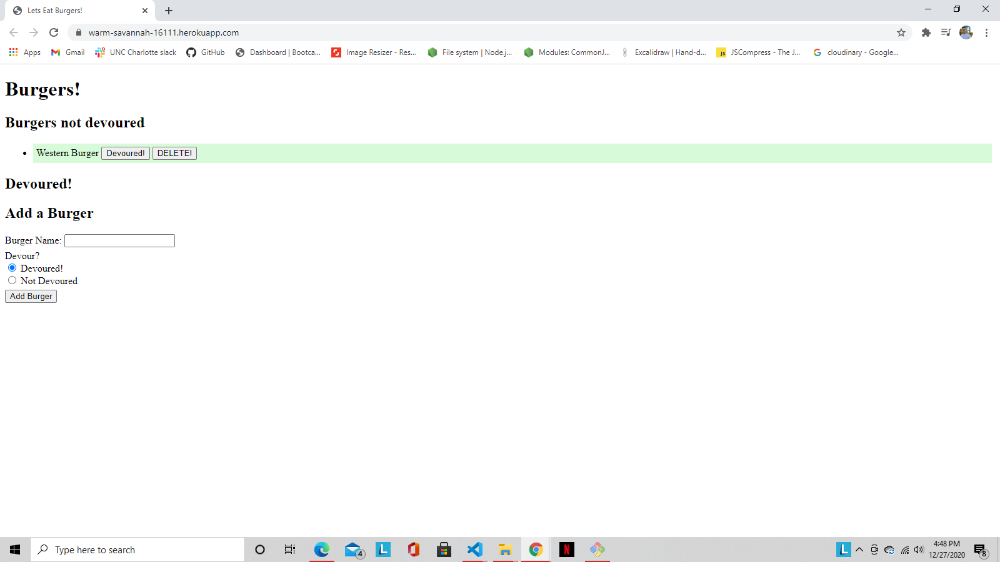

# Title
  Burger App
  

  ## Developer:
  Jesse Ziros

  ## Description
  This app will allow you to create burgers and then either devour them or toggle them back to ready to eat.

  ## Table
  * [Installation](##Installation)
  * [Usage](##Usage)
  * [Questions](##Questions)
  * [Contributing](##Contributing)
  * [License](##License)
  * [Test](##Test)

  ## Installation
  It uses node-express-handlebars for design as well as using express to deploy the app. As well as utilizing a ORM.

  ## Usage
  You will name a burger to create, and after it is created you can choose to devour it or make it ready to eat.
  

  ## Questions
  If you have any questions contact me at:

  jtziros2020@gmail.com
  
  *[Github Username]
  jesseziros

  ## Contributing
  N/A

  ## License
  MIT

  ## Test
  N/A
